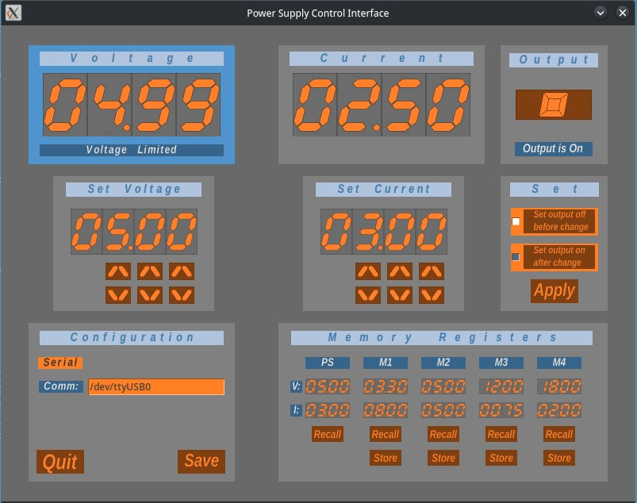
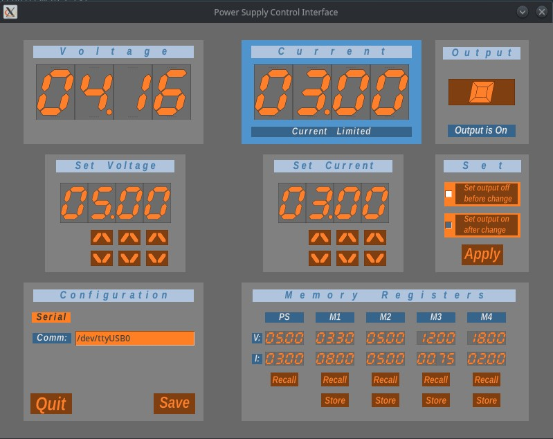
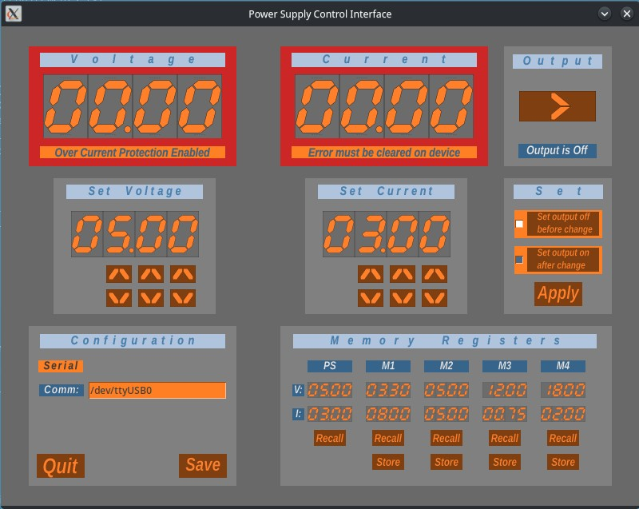

# Longwei-3010EC Bench Power Supply Control Application

## Introduction
Python/Tk application for controlling Longwei bench power supplies using USB/serial (Not tested on Windows)

### Features
- Current delivered voltage and current are displayed as well as the present voltage and current set points.
- Display changes to indicate voltage regulation, current regulation, and overcurrent protection tripped modes.
- The application maintains four memory presets independent of any memories included on the power supply unit.
- The user can adjust and apply the set points and control the output relay state.
- The serial port is automatically detected unless the port is specified in the configuration file for the application

## Screenshots
### Voltage Regulation Mode

### Current Regulation Mode

### Over Current Protection Tripped

## User instructions
- The application is intended to be easy and intuitive to use.
- Memories M1 thru M4 are for user settings
- The **PS** memory always shows the present state of the PSU
- Memories are stored from and recalled to the **Set** displays
- Values from the **Set** displays are applied to the PSU with the **Apply** button
- The current configuration of the memories can be **Saved** to a configuration file
- The configuration file is stored at `$HOME/.config/ps3010ec/config.ini`

## Notes
- The Longwei Power Supply is rebranded under other names including the Topshak LW-3010EC.  This application is also expected to work with these rebranded power supply units.
- This application was written after seeing several reports that the included control software for the power supplies was infected with a virus.
- Tested against Python 3.10.5
- After the application modifies the output relay state the front panel output button needs to be pressed twice to toggle the state.  This appears to be a firmware issue on the control board.
- The modbus documentation provided no information on the control of over current protection (OCP) mode and no registers were located through experimentation.  All OCP set/clear operations must be performed via the front panel of the PSU.

## Dependencies
See requirements.txt file

## Environment Setup
1. Clone the repository into a directory
- `git clone ps3010ec.git`
2. Go to the cloned directory and create a python virtual environment
- `cd ps3010ec`
- `python -m venv venv`
- `source venv/bin/activate`
3. Install the required packages
- `python -m pip install -r requirements.txt`
4. Start the application
- `./ps3010ec.py`

